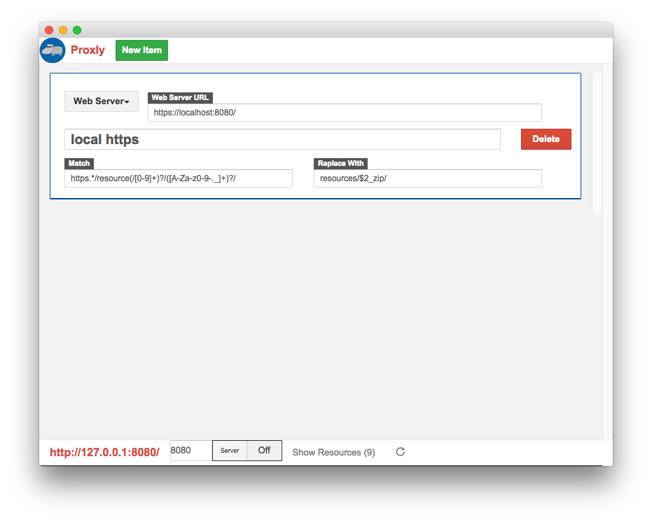
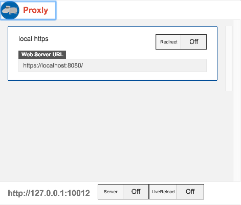

#Grunt Runner for Static Resources

### Overview:

The purpose of this project is to provide a simplified process for generating optimized Static Resources.

Currently, this is focused on JavaScript, but will expand to CSS (including SASS) and Image optimization.

**Whenever a static resource file is changed (or a new file is added to it), the tool will intelligently provide optimized versions of those resources.**

While the tools is meant to reduce the bar for those unfamiliar with Grunt, it provides a large amount of configuration to fit many needs.

### What is Grunt?

Grunt provides automation for repetitive tasks.  It can either execute those tasks on demand or by monitoring a set of files.

### How do I get started?

**System Requirements:**

* NPM  - [http://blog.npmjs.org/post/85484771375/how-to-install-npm](http://blog.npmjs.org/post/85484771375/how-to-install-npm)

* grunt CLI - [http://gruntjs.com/installing-grunt](http://gruntjs.com/installing-grunt)  or just `npm install grunt-cli grunt -g`

**Project Requirements:**

* A checkout of this project
* A `package.json` file (such as the example below) at the base of your project to provide project configuration.
* Running `npm install` (to load all the needed modules)
* A `Gruntfile.js` file to include this tool and optionally adjust build settings.

### How do I checkout this project?

Please review the Services Wiki to obtain credentials for the Services GitLab instance.

Then clone the project at [git@tig2.modelmetricssoftware.com:proth/sfdcgruntrunner.git](git@tig2.modelmetricssoftware.com:proth/sfdcgruntrunner.git)

For those not familiar with git, we recommend using [Git-Tower](git@tig2.modelmetricssoftware.com:proth/sfdcgruntrunner.git) or [Source-Tree](http://www.sourcetreeapp.com/), or reach out for help.

### Package.json

A Package.json file is the configuration for the project and includes your project's name, among other configurations.

Simply copy the Example-Package.json file to the base of your project, and update the name and description to get started / update as desired

##### NOTE:
The sample Package.json file assumes that the static resource files are in the folder 'resources', and the folders of the exploded static resources are all directly within.

	Ex:
	./
		resources/
			pb_Foundation_zip
				js/...
				css/...
				img/...
			pb_Vendor_zip
				js/...
			etc.

**If that is not the case, update the 'sfdc-runner.resourcesPath' and 'sfdc-runner.resourceFolderPattern' as appropriate.**

**Currently, after install, you will need to run `npm install` in the package directory for grunt to be available. Updating `NPM_PATH` doesn't appear to work correctly**

### Gruntfile.js

Copy the Example-Gruntfile.js to the same directory as the Package.json file.

You may need to update the line: 
	`require( './path/to/grunt-sfdc-runner.js' )(grunt)`  
	and 
	`grunt.loadTasks( './path/to/tasks' );`  
to the file within the checkout.

### Running the project:

* Navigate to the base of the project in the terminal and run: `grunt watch` (this starts watching the files) Run `grunt watch --verbose` to either troubleshoot or see which files are watched.
* Change any js file within the static resource folder Ex: `resources/pb_Foundation_zip/js/custom/MyScript.js`
* Saving the file instantly kicks off: # jslint # concat # uglify

   
  
### Sample Package.json file

	{
	  "name": "[YOUR PROJECT NAME]",
	  "version": "1.0.0",
	  
	  "description": "[Description of your project]",
	  
	  "devDependencies": {
		"grunt-ant-sfdc": "^0.2.6",
		"grunt-contrib-clean": "^0.6.0",
		"grunt-contrib-compress": "^0.12.0",
		"grunt-contrib-concat": "^0.5.0",
		"grunt-contrib-copy": "^0.7.0",
		"grunt-contrib-jshint": "^0.10.0",
		"grunt-contrib-uglify": "^0.6.0",
		"grunt-contrib-watch": "^0.6.1"
	  },
	  
	  "sfdc_runner": {
		 "resourcesPath": "resources",
		 "resourceFolderPattern": "resources/([\\w_ ]+)/",
		 "concat": {			
			"pb_Foundation": {
				"js/foundation-min.js" : ["js/foundation/**/*.js"],
				"js/vendor-min.js" : ["js/vendor/**/*.js"]
			}
		 }
	  }
	}
	
### Sample Gruntfile.js

	/*global require, chalk, module*/
	module.exports = function(grunt) {
		
		//-- update this to /path/to/tasks
		grunt.loadTasks( '../sfdcgruntrunner/tasks' );
		
		//-- update this to /path/to/grunt-sfdc-runner.js
		require( "../sfdcgruntrunner/grunt-sfdc-runner.js" )(grunt);
		
		//-- override any configuration here as desired
		//-- see 
		grunt.config.merge({
			"uglify":{
				sfdc_uglify: {
					options: {
						mangle: false
					}
				}
			}
		});
	};

### Configuring the Project

Configuration within your Package.json

	"sfdc_runner": {
		
Folder where the extracted static resources are found
		
		"resourcesPath": "resources",
		
regular expression used to determine the folder used as exploded static resource
this allows us to determine whether the file changed actually belongs to a static resource or not
the following assumes the folders found within resources are
		
		"resourceFolderPattern": "resources/([\\w_ ]+)/",
		
List of resources with their minification file, and path
USE [RESOURCE] within the minification file path to use the name of the resource
EX: [RESOURCE]-min.js could provide resources/pb_Foundation_zip/pb_Foundation-zip.js
		
		"concat": {
			
<pre>EX:
pb_Foundation: {
	js/foundation-min.js : [js/foundation/**/*.js],
	js/vendor-min.js : [js/vendor/**/*.js]
}</pre>

		}
	}
	
   
  
	

### RELATED BONUS: How do I test local changes in visualforce without a deploy?

**Impossible you say?**

#### Requirements

You need the following things:

* [Proxly Chrome Extension](https://chrome.google.com/webstore/detail/proxly-extension/ijcjmpejonmimoofbcpaliejhikaeomh?hl=en) Plugin that redirects URLs to a different URL.
* [Proxly Chrome App](https://chrome.google.com/webstore/detail/proxly/denefdoofnkgjmpbfpknihpgdhahpblh?hl=en) Defines the configuration for the Proxly Plugin
* `npm install http-server` Light-weight/zero-config https server

#### Setup

* After installing the App and the extension, open up Chrome to the app and configure it as follows: Web Server URL: `https://localhost:8080/` Match (leave as default): https.*/resource(/[0-9]+)?/([A-Za-z0-9-._]+)?/ Replace With: resources/$2_zip/ **Be sure to save**

* Open the plugin within Chrome, and you should see the config just made. **Enable redirect, but disable server and LiveReload**

* Navigate to the base directory and run the http-server npm program as follows (allowing us to use https locally)

	`http-server -S -C ../sfdcgruntrunner/localhost.cert -K ../sfdcgruntrunner/localhost.key -a localhost`
	
	>Starting up http-server, serving ./ through https on: https://localhost:8080 
	>Hit CTRL-C to stop the server

* You will now need to allow your browser to connect to https://localhost:8080 - at least once, and click 'continue to https://localhost:8080' **(Otherwise you'll get 'Failed to load resource: net::ERR_INSECURE_RESPONSE' errors)**

* Finally, navigate to a page in salesforce using a static resource, notice the URLs are different. Changing the files locally are immediately reflected within SalesForce.

